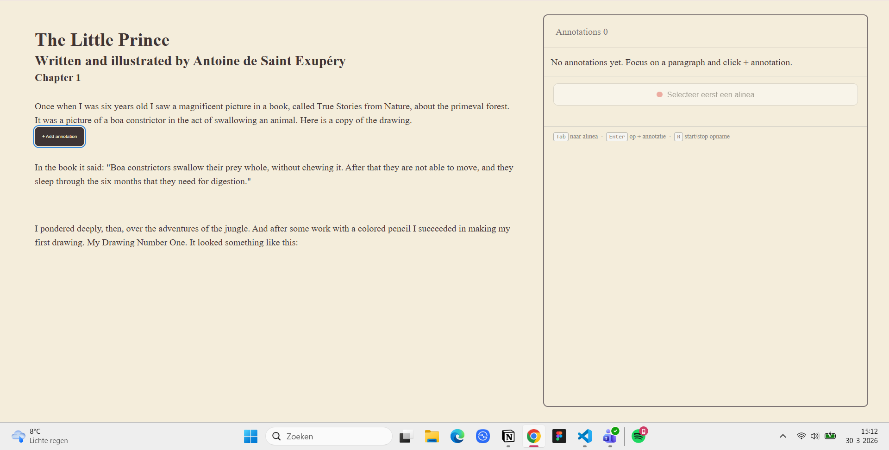
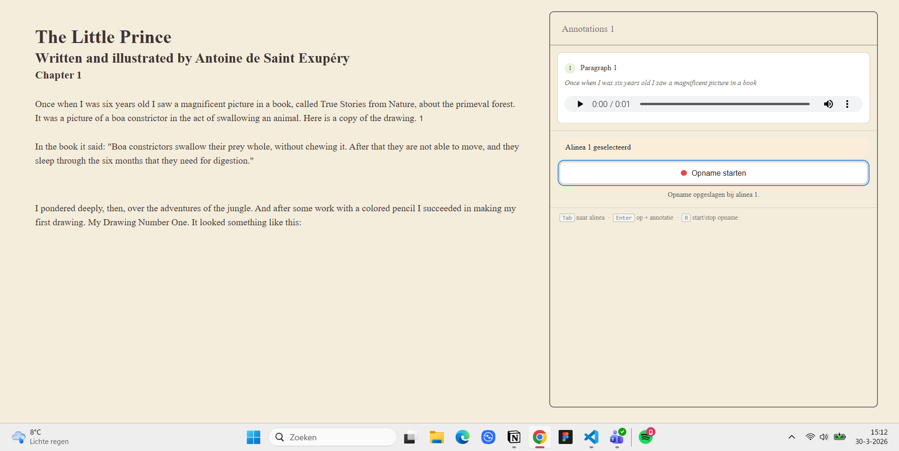
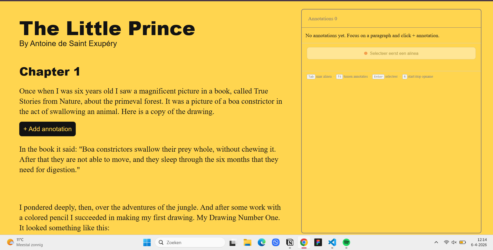
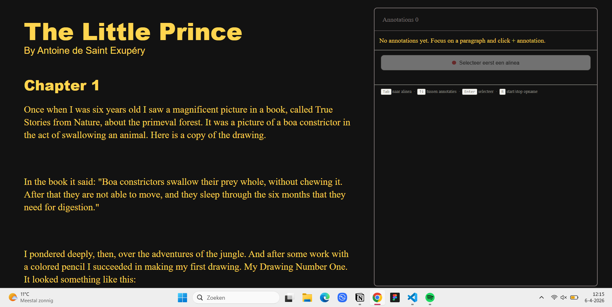
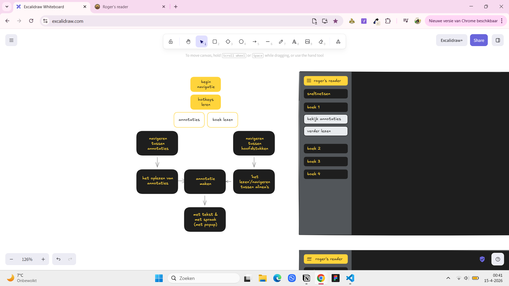
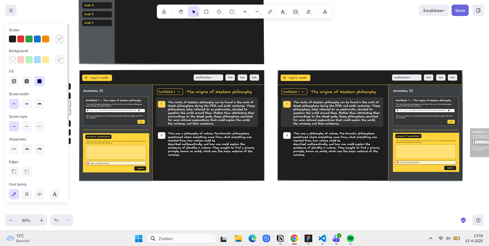
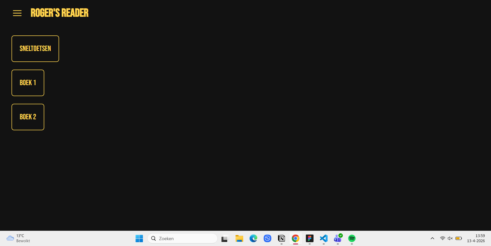
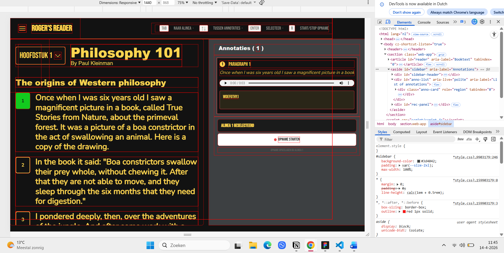
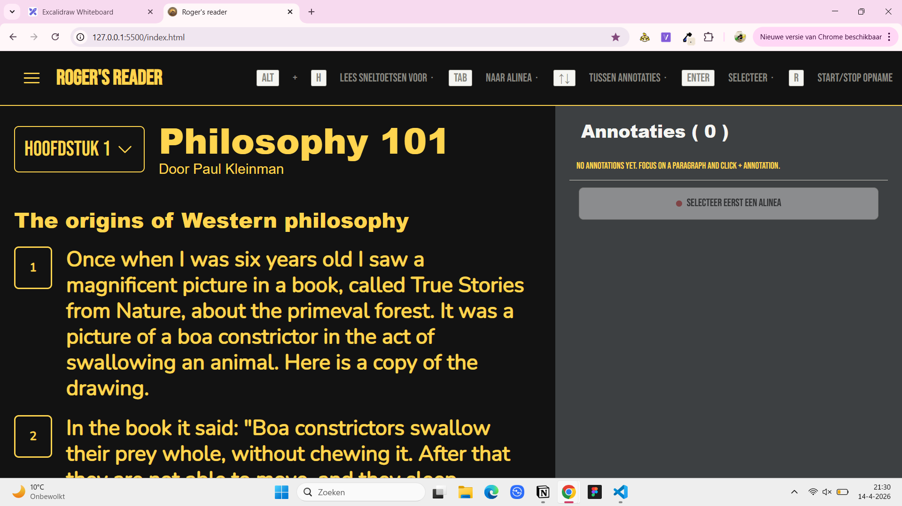
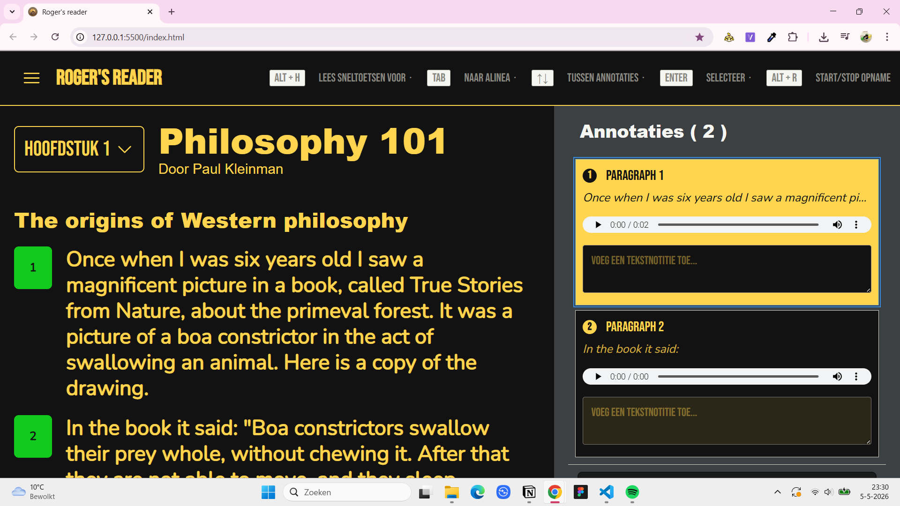

# HCD (human centered design) 
Het web is voor iedereen. Dat betekent dat we dingen kunnen maken die iedereen kan gebruiken. Maar kennen we iedereen wel? In dit vak beginnen we met iedereen te leren kennen. 

Voor dit project ga ik alleen voor 1 specifiek persoon ontwerpen. 

<strong>Wie is mijn testpersoon?</strong>
Roger studeert filosofie en hij wil graag annotaties kunnen maken in de (digitale) boeken die hij leest, en die annotaties makkelijk terug kunnen vinden. Roger heeft maculadegeneratie. Hij kan steeds slechter zien en is nu op het punt dat hij echt niet meer zonder screen reader kan.

## Week 1 | 30-03-2026 maandag
### Wat heb ik vandaag gedaan?

Vandaag heb ik een beetje ingelezen over de opdracht en ben vanuit daar een testplan (/vragenlijst) gaan opstellen van wat ik wil weten. Daarna heb ik een eerste opzetje gemaakt met behulp van claude. Het idee is dat je dan de tekst aan de linkerkant hebt en de annotaties aan de rechterkant. Je kan door elke alinea tabben en dan een voice annotatie maken. Als laatste heb ik de weekly geek gelezen.

### Wat ga ik morgen doen?
Morgen gaan we testen, dus voor de test wil ik nog even werken aan mijn prototype en alvast een vragenlijst opstellen vanuit mijn test. 

## Week 1 | 31-03-2026 dinsdag (de test)
### Wat heb ik vandaag gedaan?

Vandaag hebben we de test uitgevoerd en daaruit heb ik veel inzichten uitgehaald zoals dat dark mode beter werkt voor hem en dat hij voornamelijk ook zelf moeite heeft met het lezen van de teksten die hij vanuit school krijgt want het is niet altijd hetzelfde soort document bijvoorbeeld soms is het een pdf en soms een afbeelding van een tekst. Hier heeft hij moeite mee en zou graag alles op dezelfde plek willen/makkelijk kunnen navigeren en terugvinden. 

Hij zou het voor nu wel graag gewoon annotaties per boek terug willen vinden en per belangrijke kop, maar ook dat hij geen gebruik wil maken van voice recording uit respect voor anderen om hem heen. 

## 02-04-2026 vrijdag (voortgangsgesprek & wekelijkse reflectie)
### Wat heb ik vandaag gedaan?
Vandaag hadden we voortgangsgeprekken tijdens het gesprek hebben de tests besproken en heb ik mijn prototype even laten zien. De test zelf heeft veel bij mij opgeroepen en ik vind het moeilijk om te bedenken welke kant ik nu moet opgaan, want het voelt alsof niet perse een app wilt hebben waar hij notities in maakt. Voor nu wil ik mijn test toch even aanpassen met de opmerkingen die hij heeft gemaakt tijdens de test zoals bijvoorbeeld dat darkmode beter voor hem werkt. 

<strong>Mijn vervolgstappen</strong>
- Probeer vragen op te stellen zodat ik mijn aannames kan valideren en een klein extra te maken zodat ik kan uittesten.
    - Kleuren omdraaien
    - Document laten scannen en dat de screenreader het kan voorlezen
    - Ipv voice recording naar een speech to text

## Week 2 | 07-04-2026 dinsdag (test 2)
### Wat heb ik vandaag gedaan?
Vandaag ben ik bezig geweest met de opmaak van de site. Ik heb alles een stukje groter gemaakt. Ik hoop dat dit nu beter leesbaar is voor roger, voor nu heb ik een dark mode en een light mode om te kijken welke hij beter zou vinden. Een grote verandering die ik heb toegepast is dat de voice recording nu niet alleen een voice recording is, maar ook een speech to text. 

Vandaag hadden we al de volgende test: hij heeft deze keer ook lekker veel verteld over hoe hij normaliter navigeert met zijn telefoon, maar dit bracht ook weer vragen op bij mij zoals moet ik nu iets gaan maken voor telefoon? Maar ook andere handige meningen zoals dat hij het liefst per hoofdstuk annotaties wilt zien. 

Ik heb mijn prototype laten testen en het bleek gelijk toch al niet zo soepel te werken. Hij vond het navigeren in het begin wel doable, maar de sneltoetsen bleken al wel verwarrend te zijn. Ik had ook nog zelf niet getest met nvda, dus tijdens het opnemen bleef nvda erdoorheen praten waardoor de speech to text ook de stem van nvda meenam in de text. Dit verwarde roger ook, dus dat was al helemaal niet fijn. 

Hij had zelf nog wel aangegeven dat hij het idee van een speech to text wel fijn vond, maar hij vaak tijdens het reizen aantekeningen maakt en dat zijn situaties waarin hij niet echt kan praten. 

## Week 2 | 10-04-2026 voortgangsgesprek en wekelijkse reflectie
Ik vond deze week wel een beetje rot, want ik wist helemaal niet meer wat ik moest doen. Tijdens het testen werkte nvda niet zo goed met het navigeren/voorlezen van de site en dit frustreerde Roger, want hij wist niet helemaal hoe de speech to text werkte. Ook clashte de speech to text met de screenreader. 

Dit vond ik meer frustrerend, omdat ik het helemaal zelf nog niet had uitgeprobeerd voor de test. Dit komt wel omdat ik zelf de screenreader niet fijn vind, maar Leonie vertelde dat dit is hoe Roger zich waarschijnlijk ook voelt omdat hij op latere leeftijd pas slechtziend is geworden. Niet alleen Roger, maar een groot deel van de mensen die nu met een screenreader moeten omgaan. 

Dit heeft mij wel getoond dat ik de screenreader niet meer kan vermijden en dat ik juist eraan moet werken om het zo fijn mogelijk te maken met bijvoorbeeld aria-labels. Niet alleen aria-labels zelf, maar ook de manier hoe de aria-labels zijn. Denk aan leidende taalgebruik "vul hier een annotatie tekstvak"

<strong>Voortgangsgesprek</strong>

- denk aan aria labels
    - denk aan leidende taalgebruik - vul hier een annotatie tekstvak
- navigeren tussen annotation
- 3 delen - lezen, annotaties maken, navigatie

<strong>Wat wil ik ook nog doen?</strong>
Door het voortgangsgesprek en de test realiseerde ik me dat ik ook moest gaan focussen op hoe ik ervoor zorg dat het makkelijker wordt voor Roger om te navigeren stel er zijn meerdere boeken met meerdere hoofstukken. Om dit te doen moet ik mijn layout aanpassen denk ik. 

- hele layout
- vormgeving van de site moet anders
- javascript

## Week 3 | 13-04-2026 maandag
### Wat heb ik vandaag gedaan?

Ik vond mijn flow niet duidelijk en dat bleek ook wel uit de test, dus ik heb even een stap terug genomen en ben gaan wireframen met een duidelijkere zicht op wat ik wil qua functionaliteiten en wat ik denk dat roger gaat begrijpen. 

Ik was eerst begonnen met de navigatie. Het moest navigeerbaar zijn per boek en per hoofdstuk. De sneltoetsen moesten ook snel te vinden zijn tov hoe het eerst was (onder de annotaties). Ook moest het duidelijker zijn waar je bent. Ik was begonnen met een eerste opzet.

### Wat ga ik morgen doen?
Ik wil verder gaan met alles erinzetten.

## Week 3 | 14-04-2026 dinsdag (test)
### Wat heb ik vandaag gedaan?
Vandaag heb ik de rest van de content eringezet. De boeken zijn navigeerbaar vanuit de menu icoon en in de section van het boek zelf kan je als eerst tussen verschillende hoofdstukken heen navigeren. Wanneer er een annotatie is gemaakt is dit te zien doordat het groen qua kleur is. Ook heb ik alles een stuk groter gemaakt. 

Vandaag hadden we de derde test: voor deze test wilde ik graag weten hoe het navigeren ging. Het was een beetje uitzoeken hoe hij bij hoofdstuk twee kwam, omdat er niks visueels te zien was. 

Hij vond het ook niet fijn dat alle sneltoetsen opgelezen werden zonder het te kunnen stoppen. Verder vond hij het niet zo fijn dat als je naar een hoofdstuk ging dat het dan weer begon vanaf de header en niet gelijk bij het eerste paragraaf. 

- Het laten voorlezen van de tekst ging niet goed
- Navigeren tussen de annotaties zelf was moeilijk en het lukte hem niet om het tekstvak te vinden
- NVDA ging weer erdoorheen praten
- Sneltoetsen aanpassen

### to-do’s

- [ ]  navigatie tabben alleen in de nav en niet daarbuiten en als je erbuiten wilt dan esc
- [ ]  hoofdstuk 1 en 2
- [ ]  navigeren naar de sneltoetsen
- [ ]  styling van de annotatie verbeteren
- [ ]  navigeren tussen annotaties

## Week 3 wekelijkse reflectie (geen gesprek)
Ik heb deze week heel veel geleerd gezeten aan het navigeren van de website en het werken met de screenreader. Het is nu voor mijn gevoel veel makkelijker te volgen. Deze week was wel veel brainstormen over hoe ik mijn html moest indelen en de aria labels (wat wel moest worden voorgelezen en wat niet en hoe)

## Week 4 | 20-04-2026 maandag
### Wat heb ik vandaag gedaan?
- vandaag heb ik de navigatie naar een ander boek gedaan en de aria labels verbeterd zodat het duidelijker is
- ik heb de navigatie tussen hoofdstukken ook duidelijker gemaakt wat er gedaan moet worden
- de tekst wordt ook voorgelezen nu met het tabben en het toevoegen van annotaties is iets duidelijk
- ben nu aan het kijken of ik de nvda spreker uit kan zetten terwijl audio wordt opgenomen en ga daar morgen mee verder

## Week 4 | 21-04-2026 dinsdag (de test)
### Wat heb ik vandaag gedaan?
Vandaag heb ik niet heel veel kunnen doen, maar voornamelijk de sneltoetsen veranderd voor het stoppen en starten van opnemen en ? is voor het voorlezen van de sneltoetsen en het praat nu niet tijdens de voiceopnames

- Navigeren gaat goed. Roger vindt via de sneltoetsen en Tab de hoofdstuk-dropdown en bereikt daarna de tekst. Hij weet zelfstandig een annotatie te starten.
- Roger moest herinnerd worden aan hoe hij een opname start en wist niet hoe hij deze kon stoppen. Het uitschrijven ervaart hij als prettig.
- Roger weet niet hoe hij terug moet en vindt de weg via de URL. De tweede annotatie lukt beter, maar hij loopt opnieuw vast bij het terugkeren. Hij verwacht Shift+Tab in plaats van Tab om terug te gaan.
- Binnen de annotatie is het niet duidelijk waar de focus is. Roger vraagt hoe hij weet bij welk deel van de tekst zijn annotaties horen.
- Spraak werkt goed. Roger vraagt of hij ook mag typen en hoe hij dat zou opslaan. De uitspraak is wat onhandig, maar geen groot probleem.

## Na de test

### Wat heb ik nog gedaan na de test
Ik heb het duidelijk gemaakt waar je bent als je in de annotaties zit. Ik heb alweer een paar aanpassingen gedaan voor de sneltoetsen namelijk:

- alt + h voor sneltoetsen voorlezen ipv "?", want nvda heeft zijn eigen sneltoets voor "?" waardoor het niet werkt met de screenreader
- alt + ↑↓ voor navigeren tussen de annotaties ipv ↑↓ dit is ook ivm met nvda
- ook extra tab voor annotatie behouden want ik heb geprobeerd dat je een annotatie maakt bij de alinea zelf maar dat werkte ook tegen wanneer nvda geactiveerd was.
- focus state voor de annotaties zodat het duidelijker is 
- met esc teruggaan naar het boek

## Reflectie op design principles
### Study situations
Ik heb tijdens de testmomenten wel heel veel probeerd om op te letten op wat roger heeft gezegd, maar ik had wel voor de testmomenten meer kunnen verdiepen op de situatie van Roger. Ook had ik voor de testen nog zelf moeten testen met NVDA waardoor ik sneller achter problemen kon komen.

### Ignore conventions
Ik wilde wel proberen om tegen conventions bijvoorbeeld door de sneltoetsen voorlezen de sneltoets ? te geven ipv f1, maar dit werkte niet omdat het tegen ndva zelf ging. Verder heb ik voor de andere dingen zoals de layout wel gekozen om het conventioneel te houden zodat Roger het wel makkelijker kon navigeren.

### Prioritise identity
Roger wil annotaties per hoofdstuk en per boek terugvinden dat heb ik als uitgangspunt genomen voor de navigatie. Ook toen hij aangaf geen voice te willen gebruiken in het openbaar, heb ik dat serieus genomen en ben overgestapt op speech-to-text als alternatief.

### Add nonsense
Ik probeerde om add nonsense te doen door de speech to text toe te voegen, maar dit werkt alleen in bepaalde situaties voor Roger en nu voor wanneer hij aan het reizen is. Het is niet echt iets dat heel erg speciaal was voor Roger, maar hij vond het wel een fijne toevoeging.